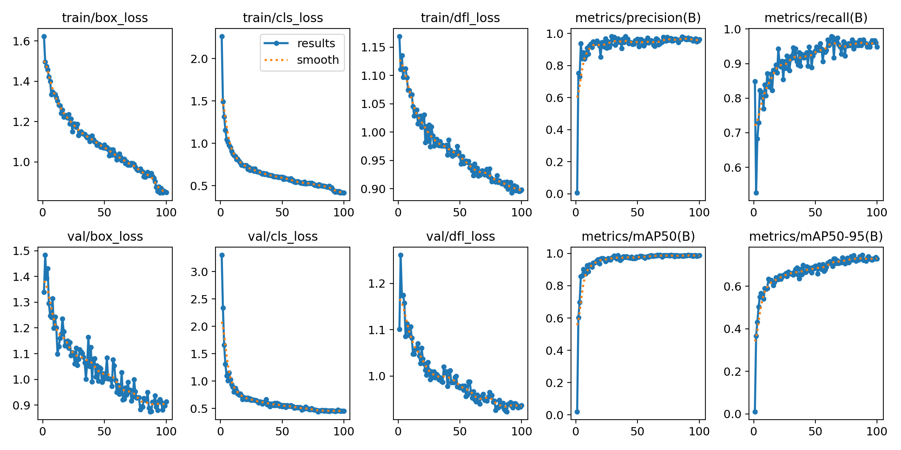
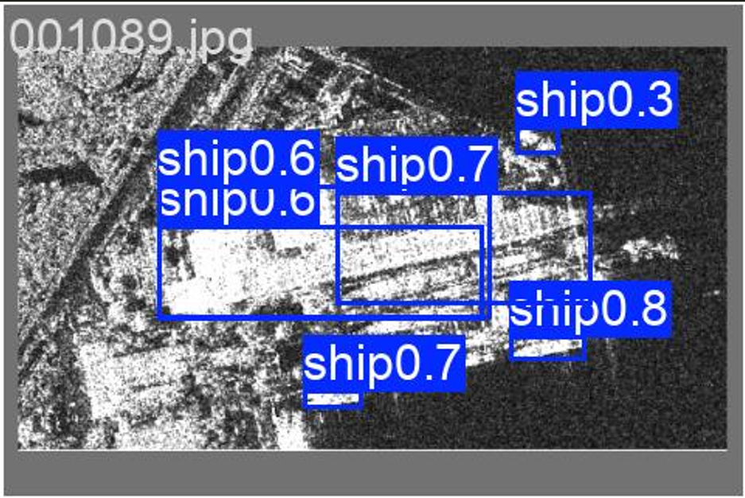
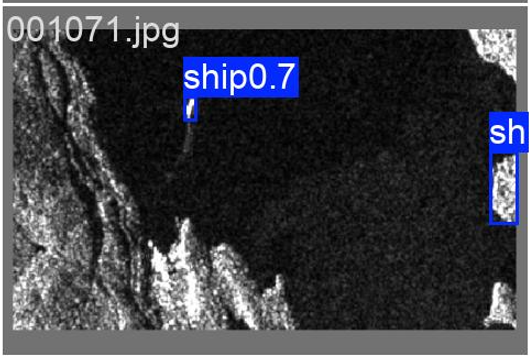
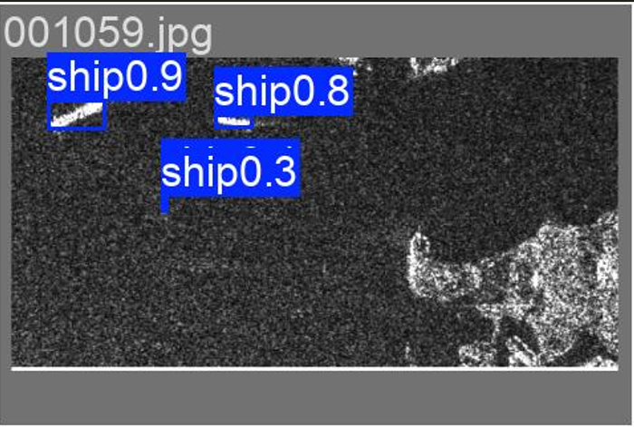

# SAR Ship Detection with YOLO

Detecting ships in Synthetic Aperture Radar (SAR) satellite imagery using a YOLOv8 object detector trained on the SSDD dataset.

SAR sees through clouds and works day and night, which makes it a key data source for maritime monitoring. Ship detection on SAR imagery is a typical **dual-use** problem: the same technology supports fisheries control, environmental protection (e.g. illegal discharges), search and rescue, and maritime domain awareness for security and defence.

> **Status:** work in progress. Stage 1 (data pipeline, baseline model, evaluation, error analysis) is complete. See [Next steps](#next-steps).

---

## Key results

Baseline: YOLOv8n, 100 epochs, image size 640.

| Split | Images | Ships | Precision | Recall | mAP50 | mAP50-95 |
|---|---:|---:|---:|---:|---:|---:|
| Validation | 93 | 192 | 0.974 | 0.968 | 0.988 | 0.746 |
| **Test (all)** | 232 | 546 | 0.972 | 0.956 | **0.990** | **0.711** |
| Test – offshore | 186 | 374 | 0.982 | 0.989 | 0.994 | 0.733 |
| Test – inshore | 46 | 172 | 0.933 | 0.894 | 0.963 | 0.661 |

**Main finding:** ships on open water are almost solved (recall 0.989), while in coastal and harbour scenes the model misses about 1 in 10 ships and box localization drops noticeably (mAP50-95: 0.661 vs 0.733). Because 80% of test images are offshore, the overall test score hides this weakness, which is why inshore and offshore are reported separately.

---

## Dataset

[SSDD (SAR Ship Detection Dataset)](https://github.com/TianwenZhang0825/Official-SSDD), official release:

- 1,160 SAR image chips with ship annotations, resolution from 1 m to 15 m, from multiple satellite sensors,
- a single class: `ship`,
- official train/test split, with the test set further divided into **inshore** (coastal, harbour) and **offshore** (open sea) scenes.

| Split | Images | Ships | Ships per image |
|---|---:|---:|---:|
| Train (official) | 928 | 2,041 | 2.2 |
| Test – inshore | 46 | 172 | 3.7 |
| Test – offshore | 186 | 374 | 2.0 |

Every image in SSDD contains at least one ship, so the model never sees an "empty sea" during training. This matters when applying it to full-size satellite scenes, where most of the area contains no ships.

The dataset is **not included** in this repository. See [How to reproduce](#how-to-reproduce).

---

## Methodology

### Data preparation

`scripts/convert_ssdd_to_yolo.py` converts the axis-aligned boxes from `BBox_SSDD/voc_style` (Pascal VOC XML, pixel corners) to the YOLO format (class, normalized box center and size).

**Validation split.** SSDD has no official validation set, and many publications validate directly on the test set. Here, 10% of the official training set (93 images, fixed seed) is held out for validation. Model selection and early stopping use only this split; the official test set is used once, for final evaluation.

| Split used for training | Images | Ships |
|---|---:|---:|
| train | 835 | 1,849 |
| val | 93 | 192 |

### Training

| Parameter | Value |
|---|---|
| Model | YOLOv8n (3.0M parameters), COCO-pretrained |
| Epochs | 100 (early stopping patience: 30) |
| Image size | 640 |
| Batch size | 16 |
| Seed | 42 |
| Hardware | NVIDIA Tesla T4 (Kaggle) |
| Training time | ~11 minutes |
| Inference speed | ~8 ms per image (T4) |



Detection quality (mAP50) saturates early, around epoch 40, while localization quality (mAP50-95) and the validation box losses keep improving until the last epoch, with no sign of overfitting. A longer training run is planned.

---

## Error analysis

Predictions on the inshore test set were inspected manually. Four types of errors were identified:

1. **High-confidence false positives on land infrastructure** (buildings, quays). These are the most serious, because they cannot be removed by a confidence threshold.
2. **False positives at image borders**, where a bright fragment of land is cut by the image edge and the model lacks the surrounding context.
3. **Missed ships moored side by side or right next to a quay**, where their radar returns merge with each other or with the shore.
4. **Low-confidence false positives on artifacts** (faint linear streaks). These are removed by a standard confidence threshold.

<!-- TODO: add 2-3 example images to docs/figures/ -->






**Why buildings look like ships.** A ship's vertical hull and the flat sea surface form a corner reflector that returns a strong signal to the satellite (double-bounce scattering). A building's wall and the flat ground form the same geometry, so both appear as bright, rectangular objects with sharp edges. This is a genuine ambiguity in the data rather than just a model failure.

**Summary:** difficulty is driven by context. Ships surrounded by water are detected reliably; ships surrounded by anything bright (land, structures, other ships) are the main source of errors.

---

## Limitations

- **Small validation set.** With 192 ships, one missed ship changes recall by about 0.5 percentage points, so small differences between experiments may be noise.
- **No empty scenes in training data.** False positive rates on full-size satellite scenes are likely to be higher than on SSDD.
- **Axis-aligned boxes.** Ships are elongated and rotated; an axis-aligned box includes a lot of background, which limits localization accuracy (see the rotated-box variant `RBox_SSDD`).

---

## Next steps

- Longer training (200 epochs), compared to the baseline on the validation set
- Larger input size (`imgsz=1024`) for small and densely moored ships
- Larger models (YOLOv8s / YOLOv8m) for better scene context
- Automated error analysis: counting true positives, false positives and misses per split
- Inference on full Sentinel-1 scenes: tiling with overlap, georeferenced detections (GeoJSON)
- Land masking with coastline data (e.g. OpenStreetMap) to remove detections on land
- Rotated bounding boxes (YOLO-OBB) using `RBox_SSDD`

---

## How to reproduce

### 1. Environment

Requires [uv](https://docs.astral.sh/uv/).

```bash
git clone https://github.com/<your-username>/sar-ship-detection.git
cd sar-ship-detection
uv sync
```

### 2. Data

Download the official SSDD release (link in the [Official-SSDD repository](https://github.com/TianwenZhang0825/Official-SSDD)), extract it, and place it so that this path exists:

```
data/SSDD/BBox_SSDD/voc_style/
```

### 3. Convert to YOLO format

```bash
uv run python scripts/convert_ssdd_to_yolo.py
```

Expected output:

```
train: 835 images, 1849 ships, 0 empty
val: 93 images, 192 ships, 0 empty
test: 232 images, 546 ships, 0 empty
test_inshore: 46 images, 172 ships, 0 empty
test_offshore: 186 images, 374 ships, 0 empty
```

### 4. Check the labels visually (optional)

```bash
uv run python scripts/visualize_labels.py
```

Images with drawn boxes are saved to `results/label_check/`.

### 5. Train and evaluate

<!-- TODO: add the Kaggle notebook to notebooks/ and describe it here -->
Training was run on Kaggle (Tesla T4). See `notebooks/` for the training and evaluation notebook. `scripts/train.py` contains a short CPU smoke test to verify the pipeline locally.

---

## Project structure

```
sar-ship-detection/
├── configs/          # dataset config for YOLO
├── docs/figures/     # figures used in this README
├── notebooks/        # training and evaluation (Kaggle)
├── results/          # metrics tables
├── scripts/          # data conversion, visualization, training
└── data/             # datasets (not tracked by git)
```

---

## Citation

This project uses the SSDD dataset. If you use it, please cite the original authors:

```
Zhang, T. et al. "SAR Ship Detection Dataset (SSDD): Official Release and
Comprehensive Data Analysis." Remote Sensing, 13(18), 3690, 2021.
```

The dataset is subject to the terms set by its authors; see the [Official-SSDD repository](https://github.com/TianwenZhang0825/Official-SSDD).